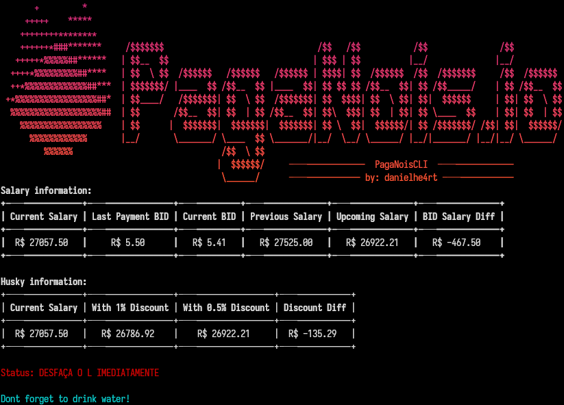

# PagaNois CLI



A tool that converts my salary based in the spread percentages made by [Husky.io (PagaNois)](https://husky.io/).

## Development

The goal is having the same features for the Ubuntu/Debian notifications also any terminal of your choice.

* [ ] Ubuntu/Debian notifications
* [x] Terminal output

## Installation

Clone the repository and install the dependencies:
```bash
git clone git@github.com:DanielHe4rt/paganois-cli-rs.git
cd paganois-cli-rs
cargo build --release
```

## Usage

TODO: Add usage instructions

```bash
./target/release/paga-nois --help
```

## License

This project is licensed under the MIT License - see the [LICENSE](LICENSE) file for details.
